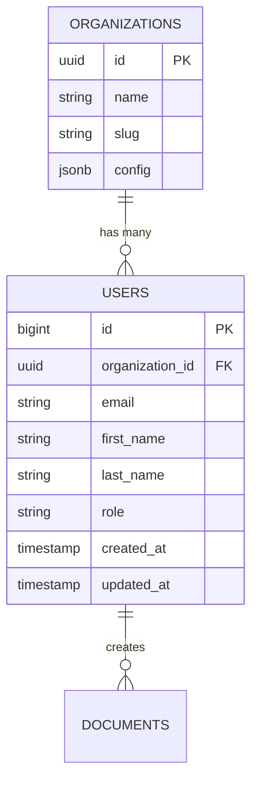

# Database Diagram Generator

Lee el schema de la base de datos y genera un diagrama ER en Mermaid.

## Process

### 1. Detectar fuente del schema

Buscar en orden de prioridad:

| Fuente | Ubicación típica |
|--------|-----------------|
| Migrations SQL | `db/migrations/`, `migrations/`, `prisma/migrations/` |
| ORM Models | `models/`, `src/core/entities/`, `app/models/` |
| Prisma Schema | `prisma/schema.prisma` |
| SQLAlchemy | `models.py`, `models/` |
| GORM structs | `*.go` con tags `gorm:"..."` |
| Django Models | `models.py` en cada app |
| TypeORM | `*.entity.ts` |
| Drizzle | `schema.ts`, `schema/` |

### 2. Parsear tablas y relaciones

Para cada tabla/modelo extraer:
- Nombre de tabla
- Columnas: nombre, tipo, nullable, default
- Primary key
- Foreign keys → tabla referenciada
- Indexes únicos
- Relaciones: 1:1, 1:N, N:M

### 3. Generar Mermaid ER



### 4. Output

1. Mostrar el diagrama Mermaid en pantalla
2. Si el usuario quiere guardarlo → escribir en `docs/db-diagram.md` o `docs/schema.md`
3. Incluir tabla resumen:

```markdown
## Tablas
| Tabla | Columnas | FK | Descripción |
|-------|----------|-----|-------------|

## Relaciones
| Tabla A | → | Tabla B | Tipo | Via |
|---------|---|---------|------|----|
```

## Rules
- Si hay múltiples fuentes (migrations + models), preferir migrations como fuente de verdad
- Agrupar tablas relacionadas visualmente
- Marcar campos nullable con `?`
- En español para descripciones, nombres de tabla como están en el código
- Si el schema es muy grande (>20 tablas), ofrecer generar por módulo/dominio
