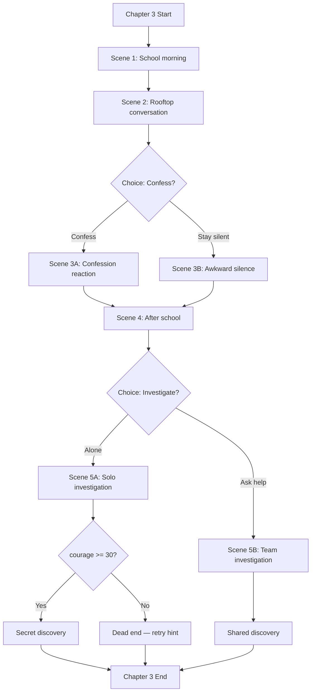

When this skill is invoked:

1. **Parse target** — chapter, route, or scene to map
2. **Load narrative context**:
   - Read `design/narrative/story-outline.md` — fail if missing:
     > "No story outline found. Run `/vn-narrative-design` first."
   - Read `game/variables.rpy` if exists — current flag/variable state
   - Read target chapter .rpy if editing existing

---

## Phase 1: Identify Choice Points

For the target scope, list every decision point:

| # | Location | Choice Text | Type | Variables Affected |
|---|----------|-------------|------|-------------------|
| 1 | ch3_scene2 | "Confess feelings" / "Stay silent" | Affinity | sakura_affinity +10/-0 |
| 2 | ch3_scene4 | "Investigate alone" / "Ask for help" | Flag | flag_solo_investigation |
| 3 | ch4_scene1 | [auto: courage >= 30] | Stat check | — (gate only) |

---

## Phase 2: Build Flow Diagram

Generate a Mermaid flowchart for the branching structure:



Write the diagram to `design/narrative/trees/[target]-flow.md`.

---

## Phase 3: Condition Matrix

Build a truth table showing how flag combinations affect outcomes:

| confessed | solo_investigate | courage>=30 | Outcome |
|-----------|-----------------|-------------|---------|
| true | true | true | Secret + romantic scene in ch5 |
| true | true | false | Dead end retry, romantic undertone |
| true | false | — | Team path + romantic subplot |
| false | true | true | Secret discovery, friendship path |
| false | true | false | Dead end retry, neutral |
| false | false | — | Team path, friendship route |

**Total unique paths through this chapter**: [count]
**Variables introduced**: [list new flags/vars]
**Variables consumed**: [list flags checked from previous chapters]

---

## Phase 4: Validate Connectivity

Check for:
- **Dead ends**: paths that don't connect to any label/jump target
- **Unreachable nodes**: labels that no path can reach
- **Orphaned flags**: flags set but never checked (or checked but never set)
- **Infinite loops**: circular jump chains
- **Missing converge points**: branches that never rejoin

Report issues:
> ⚠ Flag `solo_investigate` is set in ch3 but never checked in ch4-ch8
> ⚠ Label `chapter_3_secret_path` is unreachable (requires courage >= 30 but
>   courage max at this point is 25)

---

## Phase 5: Generate Ren'Py Skeleton

From the validated tree, generate the `.rpy` choice structure:

```renpy
label chapter_3_scene_2:
    menu:
        narrator "What should I do?"
        "Confess my feelings to [char].":
            $ sakura_affinity += 10
            $ flags.confessed_ch3 = True
            jump chapter_3_confess_path
        "Stay silent for now.":
            $ flags.confessed_ch3 = False
            jump chapter_3_silent_path
```

Write skeleton to `game/chapters/[target]_skeleton.rpy` — this is a scaffold
for `/vn-script` to fill with actual dialogue.

---

## Phase 6: Output Files

1. `design/narrative/trees/[target]-flow.md` — Mermaid diagram
2. `design/narrative/trees/[target]-conditions.md` — condition matrix
3. `game/chapters/[target]_skeleton.rpy` — Ren'Py choice skeleton (if approved)
4. Update `game/variables.rpy` with any new flags/variables introduced

Suggest next: `/vn-script chapter:[target]` to fill in dialogue
